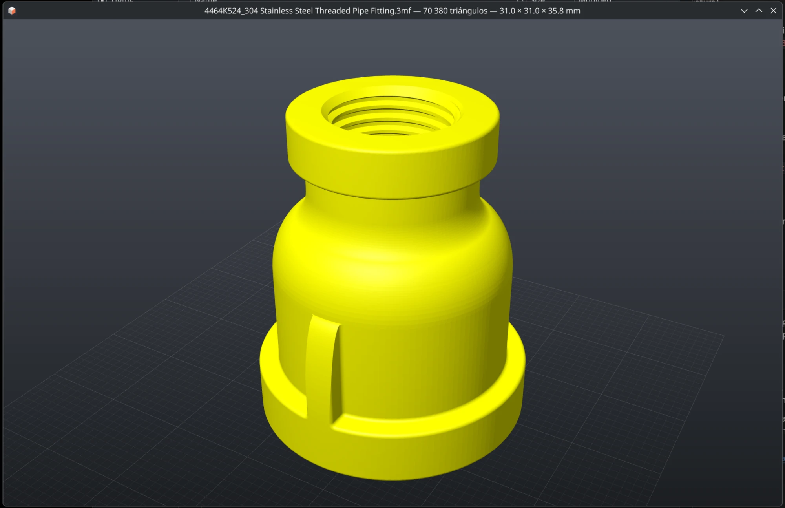

# visor3d

[](LICENSE)

Visor de modelos 3D **solo para previsualizar**, pensado para abrir al instante
archivos **STL**, **3MF** (incluidos los proyectos de **Bambu Studio** y
**OrcaSlicer**, con colores de filamento y pintado multimaterial) y **STEP**
en Linux. Incluye miniaturas para **Dolphin** (KDE Plasma).



- **Rápido**: ventana visible en ~45 ms y modelo en pantalla en ~60–90 ms
  (STL de 10 MB, gráfica integrada Intel).
- **Ligero**: un ejecutable de ~270 KB. OpenCASCADE solo se carga si abres un STEP.
- **Fiel a tu slicer**: posiciones de placa, filamento por objeto y por pieza,
  pintado MMU; omite modificadores y bloqueadores igual que Bambu/Orca.
- **Sin interfaz que estorbe**: ratón y teclado; nombre, triángulos y medidas
  en el título de la ventana.

---

## Índice

- [Instalación](#instalación)
- [Integración con KDE / Dolphin](#integración-con-kde--dolphin)
- [Uso](#uso)
- [Formatos soportados](#formatos-soportados)
- [Licencia](#licencia)

---

## Instalación

### Arch Linux / CachyOS (recomendado)

```bash
sudo pacman -S --needed base-devel cmake ninja glfw libdeflate opencascade kio kcoreaddons qt6-base
git clone https://github.com/afcruzb/visor3d.git
cd visor3d/packaging/arch && makepkg -si
```

El `PKGBUILD` compila desde el propio repositorio, así que `pacman -R visor3d`
lo desinstala limpiamente. Se compila con `-march=native`: el paquete está
pensado para la máquina donde se construye.

### Compilación manual

Requisitos: CMake ≥ 3.20, GCC ≥ 12 (o Clang con libstdc++ ≥ 12: hace falta `std::from_chars` para `float`),
GLFW ≥ 3.4, libdeflate, OpenCASCADE 7.8+ (opcional, para STEP) y KF6 KIO +
Qt 6 (opcional, para las miniaturas).

```bash
cmake -S . -B build -G Ninja -DCMAKE_BUILD_TYPE=Release -DCMAKE_INSTALL_PREFIX=/usr
ninja -C build
sudo cmake --install build
```

Opciones de CMake:

| Opción | Por defecto | Efecto |
|---|---|---|
| `VISOR3D_NATIVE` | `ON` | Optimiza para la CPU actual (`-march=native`) |
| `VISOR3D_STEP` | `ON` | Compila el plugin STEP (`libvisor3d_step.so`, OpenCASCADE) |
| `VISOR3D_THUMBNAILER` | `ON` | Compila el plugin de miniaturas de Dolphin |

Sin instalar, `build/visor3d` funciona igual: busca `libvisor3d_step.so` junto
al ejecutable.

---

## Integración con KDE / Dolphin

**Abrir con doble clic** (para tu usuario):

```bash
xdg-mime default visor3d.desktop model/stl model/3mf model/step
```

Si sale `qtpaths: command not found`, es inofensivo: `xdg-mime` busca la
herramienta de Qt 5 y la asociación se guarda igual en `~/.config/mimeapps.list`.

**Miniaturas en Dolphin:**

1. Cierra todas las ventanas de Dolphin (así detecta el plugin nuevo).
2. Configurar Dolphin → Interfaz → Vistas previas → marca
   **«3D models (visor3d)»**.
3. Sube «Omitir vistas previas de archivos locales mayores de» si tus modelos
   pesan más que el límite.
4. Activa las vistas previas en la carpeta con `F12`.

Las miniaturas de 3MF usan la imagen de placa que guardan Bambu Studio y
OrcaSlicer; el resto se renderiza por software con la misma iluminación que el
visor, sin crear contexto GL ni despertar la GPU. Los STEP de más de 32 MB solo
tienen miniatura después de abrirlos una vez en el visor (para no bloquear
Dolphin varios segundos).

---

## Uso

```
visor3d [--bench] [--shot SALIDA.png] [--info] [--thumbnail TAMAÑO SALIDA.png]
        [--no-cache] [--nvidia] ARCHIVO.{stl,3mf,step,stp}
```

### Controles

| Entrada | Acción |
|---|---|
| Botón izquierdo | Orbitar |
| Botón derecho / central / `Mayús` + izquierdo | Desplazar |
| Rueda | Zoom hacia el cursor |
| `F` / `Inicio` | Encuadrar el modelo |
| `1` … `7` | Vistas: frente, detrás, izquierda, derecha, arriba, abajo, isométrica |
| `W` | Alambre |
| `G` | Rejilla |
| `←` `→` / `RePág` `AvPág` | Archivo anterior / siguiente de la misma carpeta |
| Arrastrar y soltar | Abrir otro archivo |
| `Esc` / `Q` / `Espacio` | Salir |

El título de la ventana muestra el nombre del archivo, los triángulos y las
dimensiones X × Y × Z en milímetros.

### Opciones

| Opción | Uso |
|---|---|
| `--bench` | Imprime los tiempos de arranque tras el primer frame y sale |
| `--shot SALIDA.png` | Guarda el primer frame (con antialiasing) como PNG y sale |
| `--info` | Carga sin ventana y muestra mallas, triángulos, caja y paleta |
| `--thumbnail N SALIDA.png` | Genera la miniatura que usaría Dolphin, de N×N píxeles |
| `--no-cache` | Ignora la caché de mallas STEP |
| `--nvidia` | Permite usar la GPU NVIDIA; por defecto se fuerza la gráfica integrada (Mesa) para arrancar antes |

---

## Formatos soportados

### STL
- Binario y ASCII. Un binario cuya cabecera empieza por `solid` (lo hace
  SolidWorks) se detecta por el tamaño del archivo.
- Los archivos truncados muestran los triángulos completos que contengan.

### 3MF
- Especificación núcleo y **extensión de producción** (objetos en
  `3D/Objects/*.model`, como los escriben Bambu Studio y OrcaSlicer).
- Transformaciones de placa y de componentes, unidades del modelo.
- **Colores de Bambu Studio / OrcaSlicer**: `filament_colour` de
  `Metadata/project_settings.config` y el extrusor de cada objeto y pieza de
  `Metadata/model_settings.config`.
- **Pintado multimaterial** (`paint_color` de Bambu/Orca, `slic3rpe:mmu_segmentation`
  de PrusaSlicer): el árbol de subdivisión de cada triángulo se decodifica en
  sub-triángulos con su filamento.
- PrusaSlicer: colores de `Metadata/Slic3r_PE.config`.
- Genérico: `<basematerials>` y `<colorgroup>` por objeto o por triángulo.
- Omite modificadores, bloqueadores/forzadores de soporte y volúmenes negativos.
- Los `.gcode.3mf` ya laminados sin malla no se pueden visualizar (sí tienen
  miniatura si incluyen la imagen de placa).

### STEP (`.step`, `.stp`)
- Importación con OpenCASCADE (XCAF): colores por pieza y por cara, ensamblajes.
- Teselado de previsualización (0,15 % del tamaño del modelo, 17°) en paralelo,
  con normales suaves dentro de cada cara y aristas nítidas entre caras.
- **Caché de mallas** en `~/.cache/visor3d` (máx. 512 MB): la segunda apertura
  tarda lo mismo que un STL.

---

## Licencia

[MIT](LICENSE) © 2026 afcruzb.

Dependencias de terceros: [GLFW](https://www.glfw.org/) (zlib),
[libdeflate](https://github.com/ebiggers/libdeflate) (MIT),
[OpenCASCADE](https://dev.opencascade.org/) (LGPL 2.1 con excepción),
[Qt 6](https://www.qt.io/) y [KDE Frameworks](https://develop.kde.org/) (LGPL).
